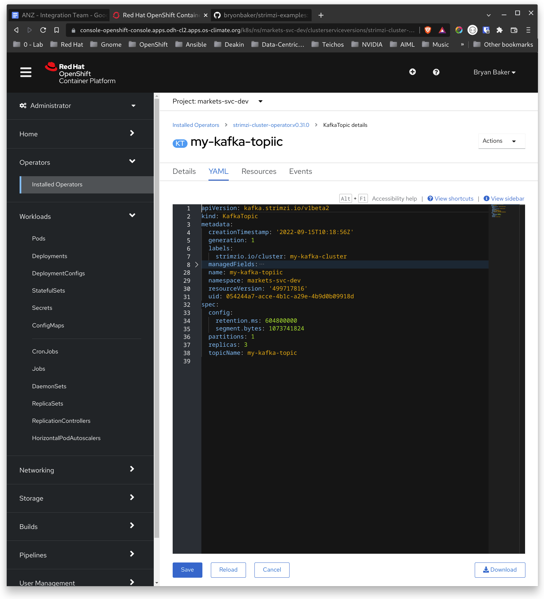

# Creating a Kafka Cluster on Strimzi

This gist provides a short example of how to create a simple kafka cluster on OpenSHift using Strimzi. The topic is only accessible from within the cluster and is unauthenticated. This gist will be refined with more detail related to securing the cluster and topic over time.

## Creating the Simple Unauthenticated Kafka Cluster
### Cluster Requirements
3 x Zookeeper

**<span style="color:yellow">REVISIT: add the cluster details.<span>**

### Create the Cluster

1. Open the namespace that you want to create the Kafka cluster.  
1. Open the Adfministrator perspective.  
2. Click Operators > Installedf Operators.  
3. Click **Strimzi**  


4. Click **Kafka** in the toolbar.  


4. Click **Create Kafka**  

5. Enter cluster name.  
6. Click **Create**  


## Create the Kafka Topic
1. Click **Installed Operators > Strimzi**
2. Click **Kafka Toic**
  

3. Click **Ctreate Kafka Topic**  

4. Enter the topic name (E.g. my-kafka-topic)
5. Delete the default label
6. Using the same name you used when you created the cluster, enter: ```strimzi.io/cluster=<the cluster name>```  
6. Specifiy the number of partitions and replication factor.
7. Enter the **Topic Name** (E.g. my-kafka-topic)  

  

8. Click **YAML view** and compare the YAML to your topic.
  